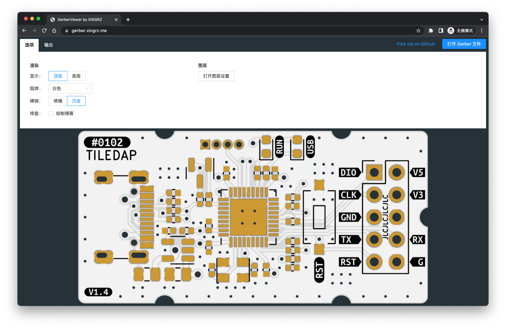

[GerberViewer](https://gerber.xingrz.me) [](https://github.com/xingrz/GerberViewer/actions/workflows/deploy.yml)
==========

[![license][license-img]][license-url] [![issues][issues-img]][issues-url] [![commits][commits-img]][commits-url]

View gerber files in your browser, and render them as SVG or PNG.



## Features

* Output top/bottom layer with nice look, to SVG or hi-resolution PNG images
* Generate relief layers that can be used in 3D modeling
* Presets of solder mask colors

## Develop

```sh
npm install
npm run dev
```

## License

[Apache-2.0](LICENSE)

[license-img]: https://img.shields.io/github/license/xingrz/GerberViewer?style=flat-square
[license-url]: LICENSE
[issues-img]: https://img.shields.io/github/issues/xingrz/GerberViewer?style=flat-square
[issues-url]: https://github.com/xingrz/GerberViewer/issues
[commits-img]: https://img.shields.io/github/last-commit/xingrz/GerberViewer?style=flat-square
[commits-url]: https://github.com/xingrz/GerberViewer/commits/master
